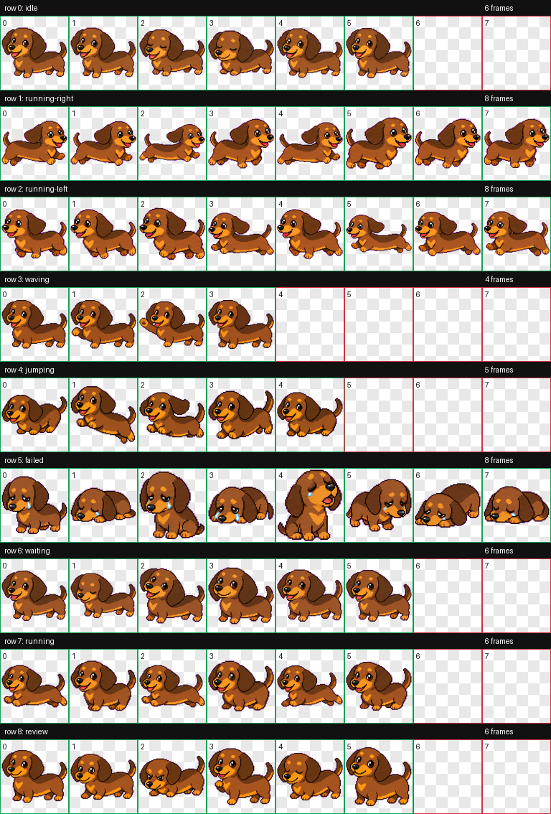

# Frankie

Frankie is a cute sausage dog pet for Codex: a small animated dachshund with a long body, floppy ears, bright eyes, tiny paws, and warm tan/chestnut markings.



## Install

Clone or download this repository, then run one of the commands below from the repository root.

### Windows PowerShell

```powershell
$Repo = Resolve-Path .
$CodexHome = if ($env:CODEX_HOME) { $env:CODEX_HOME } else { Join-Path $HOME ".codex" }
$PetDir = Join-Path $CodexHome "pets\frankie"

New-Item -ItemType Directory -Force -Path $PetDir | Out-Null
Copy-Item -Force -LiteralPath (Join-Path $Repo "final\spritesheet.webp") -Destination (Join-Path $PetDir "spritesheet.webp")

@'
{
  "id": "frankie",
  "displayName": "Frankie",
  "description": "A cute sausage dog companion with a long dachshund body, floppy ears, bright eyes, and tiny paws.",
  "spritesheetPath": "spritesheet.webp"
}
'@ | Set-Content -NoNewline -Encoding UTF8 -LiteralPath (Join-Path $PetDir "pet.json")
```

### macOS / Linux

```bash
repo="$(pwd)"
codex_home="${CODEX_HOME:-$HOME/.codex}"
pet_dir="$codex_home/pets/frankie"

mkdir -p "$pet_dir"
cp "$repo/final/spritesheet.webp" "$pet_dir/spritesheet.webp"

cat > "$pet_dir/pet.json" <<'JSON'
{
  "id": "frankie",
  "displayName": "Frankie",
  "description": "A cute sausage dog companion with a long dachshund body, floppy ears, bright eyes, and tiny paws.",
  "spritesheetPath": "spritesheet.webp"
}
JSON
```

Restart Codex after installing the files. Frankie should then be available as a local custom pet.

## Files

- `final/spritesheet.webp` - the installable Codex pet spritesheet.
- `qa/contact-sheet.png` - visual QA sheet for all animation rows.
- `qa/videos/` - MP4 previews of each animation state.
- `pet_request.json` and `imagegen-jobs.json` - provenance for the hatch run.

## Validation

The final spritesheet was validated as:

- Format: `WEBP`
- Mode: `RGBA`
- Size: `1536x1872`
- Cell size: `192x208`
- Validation errors: none
- Validation warnings: none

## Animation Rows

Frankie includes the standard Codex pet states:

- `idle`
- `running-right`
- `running-left`
- `waving`
- `jumping`
- `failed`
- `waiting`
- `running`
- `review`
